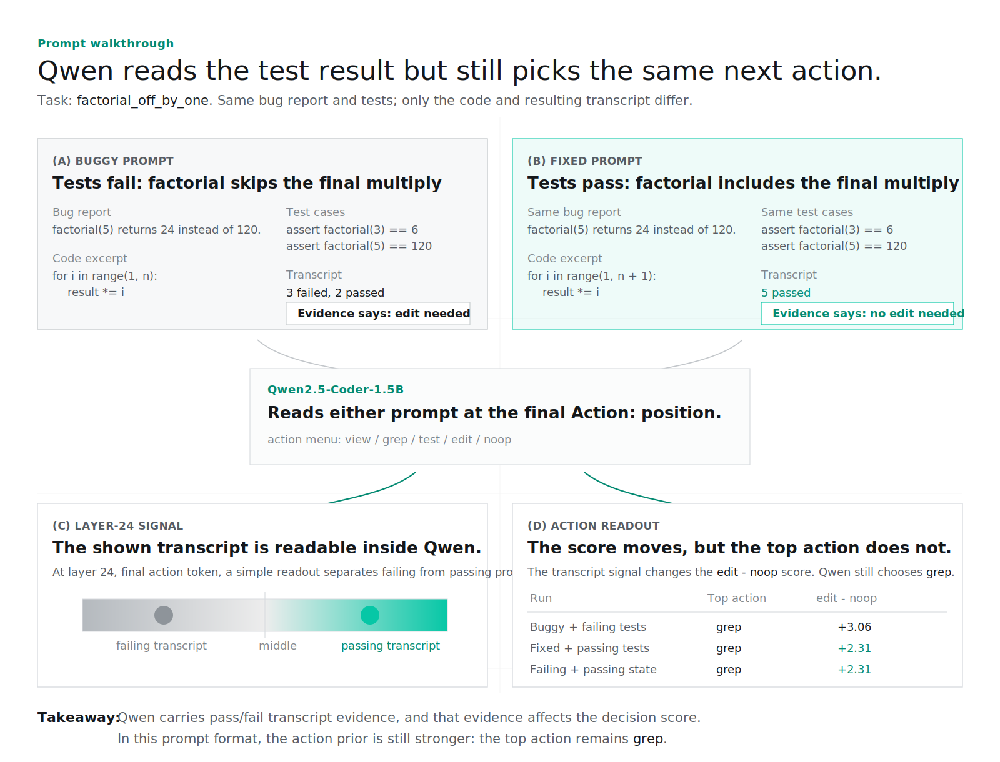

##  Evidence Is Not Enough: Pass/Fail Signals That Don't Change a Coding Agent's Action

Code, paper source, and small analysis artifacts for a mechanistic-interpretability
study of how a code language model represents pass/fail **test-transcript** evidence
at the moment it selects an action in a static coding-agent prompt.

- 📄 **Paper:** [`paper/draft.pdf`](paper/draft.pdf) (arXiv preprint forthcoming)
- 📦 **Activation caches:** [`faizancodes/no-op-circuit-caches`](https://huggingface.co/datasets/faizancodes/no-op-circuit-caches) on Hugging Face


*A **represented-evidence-vs-action dissociation**: the model represents pass/fail test evidence and it causally moves the edit-vs-noop decision, yet a strong action prior keeps it from ever choosing to do nothing.*


## Prompt walkthrough

The figure below walks through one toy paired task from `data/tasks/`: the prompt shows
the same factorial bug report and tests, once with buggy code and failing output and
once with fixed code and passing output. Qwen carries that pass/fail transcript signal
at layer 24, and swapping the signal moves the `edit - noop` score — but the top
five-action choice still stays `grep`.



**Why Qwen still chooses `grep`.** After Qwen sees the prompt, it gives a score to
each possible next action. The table shows two things: which action scores highest
overall, and how much Qwen prefers `edit` over `noop`. The test result changes that
`edit`-vs-`noop` score, which means the model has noticed whether the tests passed or
failed. But the highest-scoring action is still `grep`, so the model's internal
evidence changes the decision score without changing the action it actually chooses.

---

## Summary

**Models often represent information they don't act on** — we give a clean, causal instance
in coding agents. In a **static, single-turn** prompt where a small code model chooses among a
fixed five-action menu (`view` / `grep` / `test` / `edit` / `noop`) after seeing a test
transcript, three things come apart across 499 / 497 / 499 SWE-bench-Verified-derived paired
(buggy/fixed) prompts:

- **The explicit single-token `noop` action is never the first-token argmax** on
  Qwen2.5-Coder-1.5B or CodeGemma-7B (0%); DeepSeek-Coder-1.3B also puts 0% on the
  canonical `noop` label under a first-subword proxy (a single-token rerun reveals a
  first-position bias). The chosen action is usually `grep` / `view` / `edit` — this
  is one prompt format's first-token preference, not an agent-level abstention failure.
- **On Qwen, paired residual patching localizes a causally used action-position site
  (layer 24)** whose contrast direction tracks whether the transcript *passed or
  failed*, and that causally modulates the `edit`-vs-abstain submargin. Rank-1 steering
  reproduces the shift, and a 200-pair SWE-derived peak-cell check supports transfer of
  the effect. CodeGemma and DeepSeek show **analogous reported-cell submargin effects** —
  full causal localization is Qwen-only.
- **A frozen one-dot-product projection** separates failing-transcript from
  passing-transcript prompts at **ROC-AUC 0.989 / 0.950 / 0.888** (Qwen / CodeGemma /
  DeepSeek), with no real-task supervision.
- **Controls bound the interpretation.** When code and transcript disagree, the
  projection follows the *transcript*, not code correctness; on Qwen it is near chance
  with no transcript; and on the clean and noisy/degraded pytest-style transcript
  formats tested here, a regex or bag-of-words baseline matches or beats it.

The contribution is **mechanistic, not operational**: the model carries pass/fail
transcript evidence that causally moves an action submargin, while first-token action
priors keep abstention noncompetitive. Where a refusal direction *controls* behavior, this evidence direction moves the decision
variable without changing the action, and an internal-state edit-veto is no better than reading
the transcript here. Deployment as an edit veto would require a live
multi-step agent-loop study.

## Repository layout

```
paper/
  draft.md               # source-of-truth manuscript (Pandoc Markdown)
  build.sh               # Pandoc -> LaTeX -> pdflatex pipeline -> draft.pdf
  article_header.tex     # injected LaTeX header
  refs.bib               # bibliography
  figures/               # figures used by the paper
  draft.tex, draft.pdf   # generated LaTeX + compiled PDF
src/no_op_circuit/
  config.py              # paths, env loading, model defaults
  dataset/               # paired-task schema, generator, validator, variants
  agent/                 # action vocabulary + prompt template
  interp/                # forward-hook residual-stream cache & patching + SAE
modal_app/               # GPU jobs (run on Modal): caching, patching, steering, SAE
scripts/                 # local analysis: monitor, CIs, baselines, ablations, sweeps
data/
  tasks/                 # 49 LLM-generated toy paired tasks
  real_tasks/            # 499 SWE-bench-Verified-derived ingested instances
results/                 # small artifacts: frozen v_noop directions, patch manifests,
                         # metric JSONs (large tensors come from the HF dataset)
hf_dataset/README.md     # dataset card for the activation-cache archive
```

## Setup

```bash
python -m venv .venv && source .venv/bin/activate
pip install -e .
cp .env.example .env     # fill in MODAL_TOKEN_ID, MODAL_TOKEN_SECRET, HF_TOKEN
```

Heavy GPU dependencies (torch, transformers, accelerate) live in the Modal image.
You only need them locally to load activations in a notebook — in which case
`pip install -e ".[analysis]"`.

## Build the paper

```bash
bash paper/build.sh      # -> paper/draft.pdf
```

## Reproduce the headline results

The GPU forward passes (caching residuals, bidirectional patching, steering) run on
[Modal](https://modal.com):

```bash
modal run -m modal_app.cache_dataset --model <hf-slug> --variants issue_only,code,code_tests
modal run -m modal_app.patch_dataset --model <hf-slug> --variant code_tests --bidirectional
modal run -m modal_app.steer_dataset --model <hf-slug> --variant code_tests --layer <peak>
```

Local analysis (projection monitor, paired-bootstrap CIs and permutation null,
adversarial/text baselines, SAE ablation stats, figure rendering) runs without a GPU
via the scripts in `scripts/`. See the **Reproduction** section of the paper for the
full recipe, including the pinned-seed scaffold.

## Activation caches (Hugging Face dataset)

The ~66 GB of residual-stream activation caches the analyses run on are archived as a
public Hugging Face dataset rather than regenerated from scratch:
[`faizancodes/no-op-circuit-caches`](https://huggingface.co/datasets/faizancodes/no-op-circuit-caches).
The small artifacts the analyses also need — the frozen `v_noop` directions
(`results/steer-*/v_noop.pt`, `results/v_noop_codegemma_all49.pt`), the patching
manifests (`results/patch-*/`), and the metric JSONs (`results/monitor_real/`) — live
in this repository, so only the large tensors come from the Hub. See
[`hf_dataset/README.md`](hf_dataset/README.md) for the dataset card, including contents
and prompt-derived-metadata caveats.

```python
from huggingface_hub import snapshot_download
snapshot_download("faizancodes/no-op-circuit-caches",
                  repo_type="dataset", local_dir="results")
```

The trained SAE weights (large `.pt` tensors) are not committed here; they can be
retrained with `modal_app.train_sae` or are available on request.

## Concepts

**Paired tasks.** Each task has a `buggy/` and a `fixed/` condition with identical
issue text; only the file contents (and the resulting test transcript) differ. This
gives a matched contrast for activation patching.

**Variants** (`src/no_op_circuit/dataset/schema.py`). Per task we sweep evidence
configurations — e.g. `issue_only` (control; renders identically across conditions),
`code` (no test evidence), and `code_tests` (the main causal contrast: failing ↔
passing test transcripts).

**Actions** (`src/no_op_circuit/agent/`). `view`, `grep`, `test`, `edit`, `noop`. The
prompt ends with `Action: ` and the model's next-token logits over these names are the
edit-vs-abstain signal.

**Residual-stream hooks** (`src/no_op_circuit/interp/hooks.py`). `cache_forward(...)`
captures residual-stream activations at the final positions; `patched_forward(...)`
substitutes the residual stream at a `(layer, hook_point, position)` cell before the
rest of the network runs — the building block for activation patching. Works with any
Hugging Face causal LM whose decoder layers live at `.model.layers`, `.transformer.h`,
or `.gpt_neox.layers`.

## Citation

```bibtex
@misc{ahmed2026noopcircuit,
  title  = {Evidence Is Not Enough: Pass/Fail Signals That Don't Change a Coding Agent's Action},
  author = {Ahmed, Faizan},
  year   = {2026},
  note   = {Preprint},
  url    = {https://github.com/faizancodes/no-op-circuit-paper}
}
```

## License

Code in this repository is released under the [MIT License](LICENSE). The paper text
and figures are subject to the license of the corresponding arXiv submission. Upstream
repositories represented in the SWE-bench-Verified-derived data retain their original
licenses.
