## 1. Introduction

When a language model is used as a coding agent it acquires agency:
it can inspect files, search the repository, run tests, edit code, or
finish without change. The correct action for a stale or already-fixed
issue is `noop`. Across the full SWE-bench Verified benchmark on three
model families — Qwen2.5-Coder-1.5B, CodeGemma-7B, and DeepSeek-Coder-1.3B
— the explicit-`noop` rate is exactly **0%**. Each model hedges
differently (Qwen `grep` 90%, CodeGemma `edit` 100%, DeepSeek `view`
78%), but none ever commits to abstention. Recent reports document
this action-bias as a black-box phenomenon (Shang et al., 2026); we
ask the mechanistic question that behavioural traces alone cannot
answer: does the model lack the information to abstain, or does it
have the information and fail to act on it?

This paper localizes the edit-vs-abstain decision to a specific site
in three instruction-tuned code models, intervenes on it causally,
and validates the intervention's read-out at full benchmark scale.
Our contributions:

1. **A paired buggy/fixed substrate, toy + real.** 49 LLM-generated
   buggy/fixed Python tasks (12 bug archetypes) plus 499
   SWE-bench Verified instances, both in an identical five-action
   prompt format (`view`, `grep`, `test`, `edit`, `noop`). The
   `edit − noop` logit margin is our scalar behavioural signal.
2. **Causal localization with rank-1 steerability, replicated across
   three architectures.** A single residual-stream substitution at
   L24/pos −1 (Qwen, `resid_pre`) recovers ~98% of the buggy/fixed
   gap on 48/49 tasks; the cell is bidirectionally symmetric
   (F→B +0.69, B→F +0.64) and rank-1 steerable along v_noop with
   ‖v‖ = 5.89. The same protocol identifies homologous sites on
   CodeGemma-7B-it (L26/28, rel. depth 0.929) and
   DeepSeek-Coder-1.3B-Instruct (L22/24, rel. depth 0.917).
3. **A pre-edit veto signal that reads what the model declines to
   say.** Under stale evidence each model **never explicitly chooses
   `noop`** (0% rate across the full benchmark on all three models),
   deferring instead to `grep` (Qwen, 90%), `edit` (CodeGemma, 100%),
   or `view` (DeepSeek, 78%). A one-multiply-add monitor reading each
   model's frozen v_noop transfers to the full 500-instance Verified
   benchmark at ROC-AUC **0.989** / **0.933** / **0.888** (false-edit
   2.6% / 15.5% / 19.6%). v_noop sits at the 100th percentile of
   1000 random unit directions and matches a 1536-parameter
   full-residual probe (Appendix G).
4. **SAE decomposition: dense geometry, behaviourally sparse on
   Qwen.** Trained on task-distribution residuals (d_sae=4096,
   k=16, EV=0.976), the SAE basis spans v_noop, but encoder-TopK
   reconstruction requires k ≈ 256 features for cos ≥ 0.85. Yet a
   **minimum sufficient set of three OMP-selected features** reduces
   the buggy-fixed margin gap by **+34.0%** (CI [+26.4%, +42.0%],
   Wilcoxon p < 10⁻¹²) and **flips the model's argmax action on
   80% of prompts** (all `grep → edit`) — behavioural override, not
   calibration. The same procedure on CodeGemma yields +6.4%
   (p = 0.10, not significant); the geometric pattern replicates,
   the behavioural specificity is Qwen-specific in our data
   (Appendix H).

Together: a small, localizable, causally-validated mechanism for the
edit-vs-noop decision, and a deployable signal external systems can
read. **Paper structure.** §2–§6 cover related work, methods overview,
results, failure-mode framing, the monitor, the SAE decomposition,
and discussion. Appendices A–K contain full per-task tables, baselines
and specificity controls (G), the cross-model SAE detail (H), in-
context attribution (I), a deployment recipe with veto-semantics
patterns (J), and a reproduction recipe (K); see the table of
contents at the start of the appendix.

## 2. Related Work

**Coding-agent action bias.** Shang et al. (2026)'s TEBench
catalogues stale-test instances where the canonical action is no
change and shows that coding agents nonetheless propose edits; we
treat over-editing as the phenomenon to localize at the unit-task
level. Our 499-instance SWE-bench Verified evaluation builds on
Jimenez et al. (2024).

**Mechanistic interpretability methods.** Activation patching
(Meng et al., 2022; Wang et al., 2023; Heimersheim & Nanda, 2024;
Zhang & Nanda, 2024) and rank-1 activation steering (Turner et al.,
2023; Huang et al., 2025) are standard tools for localizing causal
sites and validating directions; Elhage et al. (2021) frame the
circuit-level view. Hewitt & Liang (2019) caution that high-AUC
probes do not establish a feature is *used*; we accordingly treat
probes as a necessary-but-not-sufficient check and rely on patching
and steering for causal claims.

**SAE feature circuits.** Bricken et al. (2023) and Templeton et al.
(2024) established dictionary-learning interpretability at scale;
Gao et al. (2024) introduced the TopK SAE we use; Marks et al. (2024)
pioneered the sparse-feature-circuit framing we extend with OMP-then-
ablate; Conmy et al. (2023) gives the automated circuit-discovery
context; Lieberum et al. (2024) provide pretrained SAE suites we did
not exercise here. Tahimic & Cheng (2025) train SAEs on code-LLM
residuals for code correctness; we study the agent's *decision to
mutate the repository*, which is upstream of correctness assessment.
Per-paper detail in Appendix A.

## 3. Methods

We work on a paired buggy/fixed substrate of 49 LLM-generated toy
Python tasks and 499 SWE-bench Verified real instances, both
ingested into an identical agent-prompt format with a five-action
single-token vocabulary (`view`, `grep`, `test`, `edit`, `noop`).
The scalar of interest is the `edit − noop` logit margin at the
action token. We evaluate three causal interventions on the
residual stream: probes (logistic regression at every (layer,
position)), paired activation patching (substituting FIXED→BUGGY
and BUGGY→FIXED at every cell and measuring the shift in margin),
and rank-1 additive steering (v_noop = mean(fixed) − mean(buggy)
at the patching peak, then sweeping additive coefficient α).
All interventions act on `resid_pre`. Full protocol, prompt
variants, hook implementation, and model details in Appendix B.

## 4. Results

**Behavioural setup.** Probes saturate at AUC ≈ 1.0 at every
(layer, position) under `code_tests` (Appendix C), confirming the
information is available somewhere in the residual stream but not
where it is *used*. Behaviourally, only the `code_tests` variant
(issue + code + test transcript) produces a systematic
buggy/fixed action shift on either model — the test transcript
is the sole driver of the effect we localize next (full
per-variant per-model table in Appendix C).

### 4.1 Causal patching

Substituting the FIXED residual into the BUGGY forward at
(layer × position) on Qwen yields a heatmap (Figure 1B) with a
clean late-layer concentration at the action position. The signal
is essentially zero in L0–L16 and ramps monotonically through
L18–L26, peaking at **L24/pos −1** with **mean shift +0.648
logits** (median +0.688, 100% of tasks positive in F→B). On
the 43 Qwen pairs we evaluated bidirectionally, F→B and B→F mean
shifts at this cell are **+0.69 and +0.64 logits** with 100%
per-direction positivity. The bidirectional minimum
(min(F→B, B→F) per cell, then ranked) puts the same site at the
top, ruling out the trivial alternative that we are merely
erasing information. A `code`-variant negative control (no test
transcript) shows no positive peak — F→B mean shift at L24/pos
−1 is +0.015 (median 0.000, 45% positive, essentially chance) —
confirming the site is a test-evidence-conditional readout.
Full patching heatmaps and the negative control in Appendix D.

### 4.2 Steering with a single rank-1 direction

Computing `v_noop = mean(fixed) − mean(buggy)` at L24/pos −1 on
Qwen (N=49, ‖v‖ = 5.892) and sweeping additive coefficients
yields the dose-response in Figure 1C: the mean `edit − noop`
margin moves smoothly and monotonically with α in both
conditions, and α = +1 drops buggy margin by 0.656 logits —
essentially the full behavioural gap. The no-op information
lives along **one specific direction**, not in a high-rank
subspace. Per-task dose-response curves in Appendix E.

### 4.3 Cross-model replication (3 model families)

Repeating the protocol on two additional models:

| model | layers | peak (layer, pos) | rel. depth | F→B peak | B→F peak | clean (B−F) gap |
|---|---:|---:|---:|---:|---:|---:|
| Qwen2.5-Coder-1.5B-Inst    | 28 | L24, pos −1 | 0.857 | +0.69 | +0.64 | +5.89 |
| CodeGemma-7B-it            | 28 | L26, pos −1 | 0.929 | +1.143 | +1.184 | ~2 (resp. 20) |
| **DeepSeek-Coder-1.3B-Inst** | **24** | **L22, pos −1** | **0.917** | **+0.194** | **+0.184** | **+0.204** |

All three peaks are at the action position; relative depths
cluster in [0.857, 0.929]. **CodeGemma**'s peak magnitude is ~2×
Qwen's, but per-task universality is bimodal (53–61% of tasks
recover ~2 logits, the rest near zero), so we derive v_noop_cg
from the 20 responsive tasks (‖v‖ = 6.678). **DeepSeek-1.3B**'s
toy buggy-fixed gap is tiny (+0.20, median 0.00; 16 of 49 toys
have identical margins under buggy and fixed), yet patching at
L22/pos −1 recovers 90% of *that* small gap and v_noop_ds
(‖v‖ = 12.255) transfers to real tasks (§5.1). The mechanism
localises on every model; absolute behavioural-saliency on toys
varies by an order of magnitude across models — a divergence we
revisit in §6.

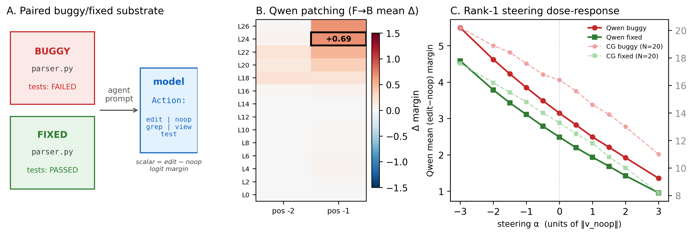{width=99%}

## 5. What the Model Won't Say: From Failure Mode to Pre-Edit Veto

The `stale_misleading` and `stale_flaky` variants probe what the
no-op mechanism does when evidence disagrees with itself (Qwen,
N=49 each):

| variant            | argmax = edit | argmax = noop | argmax = grep | proj on v_noop |
|--------------------|---------------|----------------|----------------|----------------|
| stale_misleading   | 8.2%          | **0.0%**       | 91.8%          | −1.22          |
| stale_flaky        | 6.1%          | **0.0%**       | 93.9%          | −2.81          |
| (clean buggy)      | 29%           | —              | —              | −5.53          |
| (clean fixed)      | 41%           | —              | —              | +0.36          |

**The 0% noop rate IS the failure mode.** Across 98 stale-evidence
prompts the model never commits to explicit abstention; it
defaults to `grep` >90% of the time. The internal v_noop
projection sits between the clean-buggy and clean-fixed baselines:
the no-op direction *is* being computed, but the readout to the
overt action is suppressed. The substrate of the TEBench-style
over-edit phenomenon, as observed here, is not "the model wrongly
commits to edit" — edit-rate stays modest at 6–8% — but "the
model fails to commit to `noop` when its own representation
supports it." A monitor thresholding the projection converts the
latent signal into an overt abstention recommendation (Appendix F
contains the LOOCV toy-monitor ROC at AUC = 1.000).

### 5.1 Real-task generalization at full SWE-bench Verified scale

We evaluate the **same frozen v_noop direction** — computed once
on the toy tasks, never retrained — on the **full 500-instance
SWE-bench Verified benchmark** (1 instance dropped at ingestion:
file 404; 2 additional CodeGemma instances dropped for exceeding
a 2400-token cap to avoid A10G OOM on the 7B model; full
ingestion + drop accounting in Appendix G).

| metric                    | Qwen-1.5B          | CodeGemma-7B       | DeepSeek-1.3B      |
|---------------------------|--------------------|--------------------|--------------------|
| ROC-AUC                   | **0.989**          | **0.933**          | **0.888**          |
| AP                        | 0.991              | 0.927              | 0.879              |
| Operating-point precision | **0.973** (468/481)| 0.852 (443/520)    | 0.809 (414/512)    |
| Operating-point recall    | 0.938 (468/499)    | 0.891 (443/497)    | 0.830 (414/499)    |
| False-edit rate           | **0.026** (13/499) | 0.155 (77/497)     | 0.196 (98/499)     |

All three monitors exceed the STRONG-transfer gate (AUC ≥ 0.80,
projection gap > 1.5) with model-class-specific strength. Each
model uses a different argmax-action hedge — Qwen `grep` 90%/83%
buggy/fixed, CodeGemma `edit` 100% in both, DeepSeek `view` 78%/85%
— but the explicit-noop rate is **0% on all three models** across
the full benchmark, despite the monitor's projection cleanly
separating the conditions (gaps +4.73 Qwen, +2.87 CodeGemma, +5.64
DeepSeek). The no-op signal is internally present on every model
and never emitted to the action on any of them: a monitor-mediated
agent could veto these spurious edits before they reach review
even though the unaided model is incapable of declining to emit
them. v_noop's privileged-direction baselines, the
per-repo regression analysis driving CodeGemma's 15.5% false-edit
rate (concentrated in `django/django` at 19.0% and
`sphinx-doc/sphinx` at 27.3%), and a per-repo calibration
counterfactual that drops the pooled false-edit rate to 10.7% are
in Appendix G.

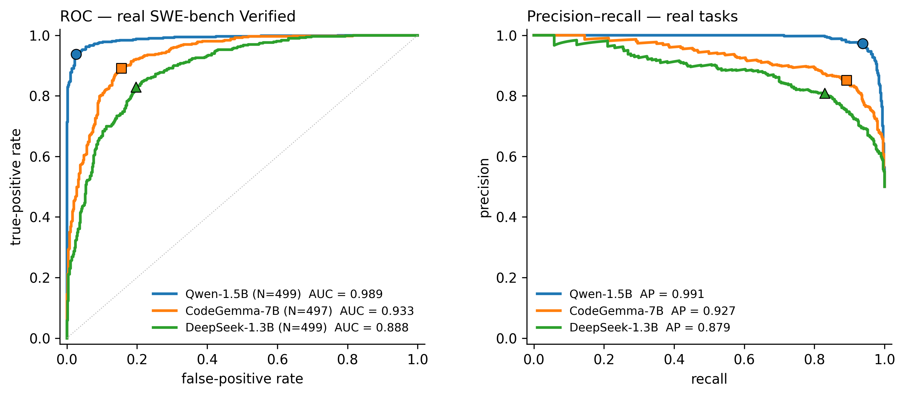{width=98%}

### 5.2 SAE decomposition: dense geometry, behaviourally sparse

We train a TopK SAE on Qwen L24 resid_pre over the task substrate
(d_in=1536, d_sae=4096, k=16, EV=0.976 over 1.23M positions).
v_noop is **geometrically dense** in this basis — orthogonal
matching pursuit (OMP) needs k ≈ 128 features for cos ≥ 0.80 and
k ≈ 256 for cos ≥ 0.85 — but **behaviourally sparse**: a cumulative
top-k OMP ablation sweep over k ∈ {1, 2, 3, …, 8, 16, 32, 128}
shows the gap reduction is essentially zero at k = 1, jumps to
**+26.4%** at k = 2, hits **+34.0%** at k = 3, and is flat through
k = 8 (Figure 3A). The minimum sufficient subset is **three
features**, all with semantically coherent logit-lens
interpretations (error/traceback-attention suppression, "already
done" semantics, action-token suppression — see Appendix H).
The reduction is **behavioural override**, not calibration:
ablating the OMP top-8 flips the model's argmax action on
**80.1% of prompts (237/296)**, every flip is `grep → edit`
(Figure 3B). Specificity controls — random-8 baselines drawn
from both the full SAE basis and from the firing-feature subset
(Mann-Whitney p ≈ 3 × 10⁻⁹⁶ and 3.9 × 10⁻¹⁷ vs OMP top-8) — and
the cross-model replication on CodeGemma, where the same OMP
top-8 ablation gives only **+6.4% (p = 0.10, not significant)**
even though the geometric pattern replicates, are in Appendix H.
The behavioural-sparse pattern is Qwen-specific in our data.

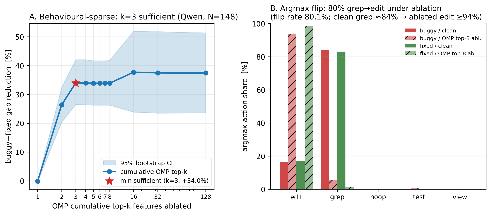{width=98%}

## 6. Discussion and Limitations

**A pre-edit veto signal that transfers across three model
families.** Project `resid_pre[L_peak, pos −1]` onto each model's
frozen v_noop and threshold. When the projection crosses a
calibrated boundary, the agent believes a patch is unwarranted;
this gates `edit` actions in production at one multiply-add of
inference cost. The monitor transfers across three model
families at SWE-bench Verified scale, but with model-class-
specific strength (AUC 0.989 / 0.933 / 0.888); per-model
threshold calibration is necessary for deployment, and on
CodeGemma per-repo calibration further drops the pooled false-
edit rate from 15.5% to 10.7% (Appendices G, J).

**The mechanism that makes it possible.** A single 1536-dim
direction at one (layer, position) site reproduces the entire
behavioural buggy/fixed gap as a continuous dose-response on
Qwen, with bidirectional symmetry and a confirmed negative
control on the `code` variant. The same protocol identifies
homologous sites on CodeGemma-7B and DeepSeek-Coder-1.3B at the
action position with relative depths in [0.857, 0.929] —
confirming this is not a Qwen idiosyncrasy.

**Toy-vs-real saliency divergence on DeepSeek.** DeepSeek-1.3B's
toy buggy-fixed gap is +0.20 logits but the same frozen v_noop
produces a +5.64-logit gap on real SWE-bench Verified (monitor
AUC 0.888) — a 28× saliency divergence we surface but do not
disambiguate; the methodological implication is that toy
substrate alone is not a reliable predictor of cross-model
monitor strength (Appendix J).

**Limitations.**

- *Toy substrate, partially addressed.* Mechanism identification
  uses 49 LLM-generated single-file Python toys; real-task
  transfer is validated at full SWE-bench Verified scale (Qwen
  AUC 0.989, CodeGemma 0.933, DeepSeek 0.888). Untested:
  prompts requiring much longer context windows, and projects
  outside Python.
- *Three models, all chat-fine-tuned code families.* Untested:
  base models, mixture-of-experts, instruction-tuned non-code
  models. Monitor-transfer strength varies substantially across
  the three families tested.
- *SAE behavioural specificity is Qwen-specific.* The 3-feature
  minimum-sufficient set and 80% argmax-flip result hold on Qwen
  but the same OMP top-8 ablation on CodeGemma gives p = 0.10
  (not significant). We attribute candidate explanations to
  lower CodeGemma SAE EV, smaller v_noop_cg source set, and
  possible architecture-dependent encoding without disambiguating
  (Appendix H).
- *No production validation.* Appendix J sketches a deployment
  recipe (per-model + per-repo threshold calibration, three veto-
  semantics integration patterns) but we have not validated any
  of it in a real agent loop.
- *In-context attribution is window-limited.* Existing cache covers
  only the last 32 tokens; v_noop signal is detectable throughout
  the prompt tail and concentrates at the action-suffix tokens
  (Appendix I).

## References

- Bricken, T., Templeton, A., Batson, J., Chen, B., Jermyn, A., et al.
  (2023). *Towards Monosemanticity: Decomposing Language Models With
  Dictionary Learning*. Transformer Circuits Thread.
- Conmy, A., Mavor-Parker, A. N., Lynch, A., Heimersheim, S., &
  Garriga-Alonso, A. (2023). *Towards Automated Circuit Discovery for
  Mechanistic Interpretability*. NeurIPS 2023 (Spotlight). arXiv:2304.14997.
- Elhage, N., Nanda, N., Olsson, C., Henighan, T., Joseph, N., Mann, B.,
  et al. (2021). *A Mathematical Framework for Transformer Circuits*.
  Transformer Circuits Thread.
- Gao, L., Goh, G., Olah, C., et al. (2024). *Scaling and evaluating sparse
  autoencoders*. arXiv:2406.04093.
- Heimersheim, S., & Nanda, N. (2024). *How to use and interpret activation
  patching*. arXiv:2404.15255.
- Hewitt, J., & Liang, P. (2019). *Designing and Interpreting Probes with
  Control Tasks*. EMNLP-IJCNLP 2019. arXiv:1909.03368.
- Huang, Y., Chen, H., Ruan, S., et al. (2025). *Mitigating Overthinking in
  Large Reasoning Models via Manifold Steering*. arXiv:2505.22411.
- Jimenez, C. E., Yang, J., Wettig, A., Yao, S., Pei, K., Press, O., &
  Narasimhan, K. (2024). *SWE-bench: Can Language Models Resolve
  Real-World GitHub Issues?* ICLR 2024. arXiv:2310.06770.
- Lieberum, T., Rajamanoharan, S., Conmy, A., Smith, L., Sonnerat, N.,
  Varma, V., Kramár, J., Dragan, A., Shah, R., & Nanda, N. (2024).
  *Gemma Scope: Open Sparse Autoencoders Everywhere All At Once on
  Gemma 2*. arXiv:2408.05147.
- Marks, S., Rager, C., Michaud, E. J., Belinkov, Y., Bau, D., & Mueller,
  A. (2024). *Sparse Feature Circuits: Discovering and Editing
  Interpretable Causal Graphs in Language Models*. arXiv:2403.19647.
- Meng, K., Bau, D., Andonian, A., & Belinkov, Y. (2022). *Locating and
  Editing Factual Associations in GPT*. NeurIPS 2022. arXiv:2202.05262.
- Shang, Y., Zhang, Q., Hu, H., et al. (2026). *Breaking, Stale, or Missing?
  Benchmarking Coding Agents on Project-Level Test Evolution*.
  arXiv:2605.06125.
- Tahimic, K., & Cheng, C. (2025). *Mechanistic Interpretability of Code
  Correctness in LLMs via Sparse Autoencoders*. arXiv:2510.02917.
- Templeton, A., Conerly, T., Marcus, J., et al. (2024). *Scaling
  Monosemanticity: Extracting Interpretable Features from Claude 3
  Sonnet*. Anthropic technical report. transformer-circuits.pub.
- Turner, A. M., Thiergart, L., Leech, G., et al. (2023). *Steering Language
  Models With Activation Engineering* (a.k.a. Activation Addition / ActAdd).
  arXiv:2308.10248.
- Wang, K., Variengien, A., Conmy, A., Shlegeris, B., & Steinhardt, J.
  (2023). *Interpretability in the Wild: A Circuit for Indirect Object
  Identification in GPT-2 small*. ICLR 2023. arXiv:2211.00593.
- Zhang, F., & Nanda, N. (2024). *Towards Best Practices of Activation
  Patching in Language Models: Metrics and Methods*. ICLR 2024.
  arXiv:2309.16042.

\newpage
\appendix

# Appendix

**Contents.** Appendix A: extended related work. B: detailed methods.
C: behavioural Δ-margin and probe saturation. D: full patching
heatmaps and the negative control. E: per-task steering dose-response
curves. F: stale-variant failure analysis and toy-monitor LOOCV.
G: full real-task evaluation including specificity baselines,
per-repo CodeGemma regression analysis, and per-repo calibration
counterfactual. H: full SAE decomposition (Qwen and CodeGemma).
I: in-context attribution within the cached last-32-token window.
J: practical deployment considerations (per-model threshold
calibration recipe and veto-semantics integration patterns).
K: reproduction recipe.

## A. Extended Related Work

The §2 references compressed several lines of evidence per cited
paper. The per-paper detail:

**Coding-agent action bias on stale tasks (Shang et al., 2026;
TEBench).** The TEBench project-level test-evolution benchmark
catalogues "stale-test" instances where the canonical action is no
change, and shows that coding agents nonetheless propose edits. Our
paired-task substrate is methodologically downstream of this
observation; we treat over-editing as the phenomenon to localize at
the unit-task level.

**Activation steering for behavioural control.** Turner et al. (2023)
introduced *Activation Addition* (ActAdd), demonstrating that a single
additive direction in residual space, computed from contrastive prompt
pairs, can steer model behaviour without optimisation or labelled data.
Most directly related, *Manifold Steering* (Huang et al., 2025) shows
that overthinking in large reasoning models can be captured by a
low-dimensional manifold and steered by intervening along the dominant
direction, reducing redundant deliberation while preserving accuracy.
Our v_noop direction is the same kind of object (mean-difference at a
fixed (layer, position) cell), but identified by causal localisation
on edit-vs-noop rather than chosen a priori for overthinking
behaviour.

**Activation patching for causal localisation.** Activation patching
(Meng et al., 2022; Wang et al., 2023) — and circuit-level analysis
in general (Elhage et al., 2021) — are the standard tools for
identifying which residual stream sites carry information that a
downstream computation reads from. Heimersheim & Nanda (2024) and Zhang
& Nanda (2024) give practical guides and metric recommendations
(notably the logit-difference metric we adopt). Our use of paired
buggy/fixed prompts and the `edit − noop` margin follows this protocol.

**Probes need control tasks.** Hewitt & Liang (2019) showed that a
high-AUC linear probe does not establish that the underlying model
*uses* the probed feature — high probe accuracy can reflect probe
capacity rather than feature usage. Our probe results saturate at AUC
≈ 1.0 across all layers; we treat them as necessary but not sufficient,
and rely on patching and steering for causal claims.

**Sparse features for code correctness.** Tahimic & Cheng (2025) train
sparse autoencoders on code-LLM residuals and identify directions
correlating with code correctness, finding test-case attention is the
primary signal (echoing our finding that *test transcripts* are the
sole behavioural driver). They study correct-vs-incorrect *code
features*; we study the *agent's decision* to mutate the repository,
which is upstream of and distinct from correctness assessment, and we
localise to a single (layer, position) cell rather than a feature
collection.

## B. Detailed Methods

### B.1 Paired-task substrate

Each task `t` provides two task snapshots with identical issue text:
`buggy/parser.py` where `pytest` reports a failure, and `fixed/parser.py`
where it passes. We generated 49 such pairs across 12 archetypes via
`anthropic/claude-sonnet-4.5` and validated each by executing pytest in a
sandbox: only pairs where `fixed` exits 0 and `buggy` exits 1 are accepted.
We further evaluate five evidence variants per task:

- `issue_only`: bug report only.
- `code`: bug report + the buggy or fixed source.
- `code_tests`: + the corresponding pytest transcript.
- `stale_misleading`: bug report claims a bug, but the fixed code and
  passing transcript are shown (one-sided control).
- `stale_flaky`: as `stale_misleading` but with one synthetic unrelated
  flaky failure spliced in (e.g. `test_network_timeout` failing with a
  `ConnectionError`).

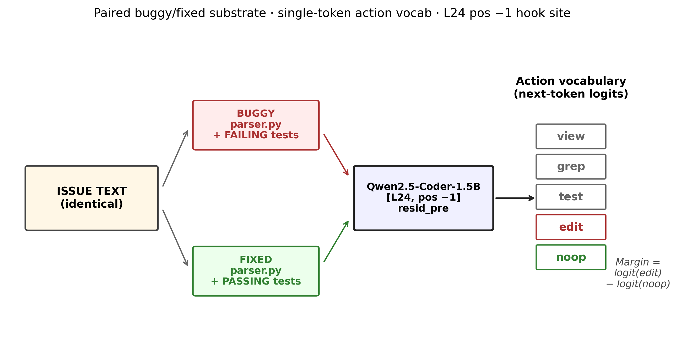{width=90%}

### B.2 Action vocabulary

The prompt ends with `<chat-template-end>\nAction: ` and the model's first
predicted token is read out. We restrict the comparison to five named
actions — `view`, `grep`, `test`, `edit`, `noop` — chosen so that each
resolves to a single BPE token under both the Qwen and Gemma tokenizers
(verified). The scalar of interest is the `edit − noop` logit margin.

### B.3 Residual-stream hooks

We register PyTorch `forward_pre_hook`s on `model.model.layers[i]` of the
underlying HuggingFace causal-LM model (no use of TransformerLens; we work
directly on Qwen2 and Gemma decoder architectures to avoid reimplemented-
arch drift). Three context managers expose:

- `cache_forward(last_k=K)`: captures `resid_pre[L]`, `resid_post[L]`, and
  the final layernorm output at the last K positions per forward pass.
- `patched_forward([(layer, hook_point, position, value)])`: replaces the
  residual at the indicated (layer, position) with `value` for one forward.
- `steered_forward([(layer, hook_point, position, direction, alpha)])`:
  adds `alpha · direction` to the residual at the indicated cell.

All interventions act on `resid_pre` (the input to layer L), matching the
canonical activation-patching site in the mech-interp literature.

### B.4 Three interventions

1. **Probes.** Logistic regression at every (layer, position) predicting
   condition from `resid_post` features, with 5-fold stratified CV. Used as
   a necessary-but-not-sufficient check.
2. **Paired activation patching.** For each (task, layer, position) cell,
   substitute the FIXED residual into the BUGGY forward (F→B) and measure
   the shift in `edit − noop` margin. **Bidirectional patching** additionally
   substitutes BUGGY into FIXED (B→F). The hypothesis-confirming sign is
   `clean_buggy − patched > 0` (F→B) and `patched − clean_fixed > 0` (B→F).
3. **Single-direction steering.** Compute `v_noop = mean(fixed) − mean(buggy)`
   at the patching peak. Sweep `α ∈ {−3, −2, −1.5, −1, −0.5, 0, 0.5, 1,
   1.5, 2, 3}` and record action logits per (task, condition, α).

### B.5 Models

Primary: **Qwen/Qwen2.5-Coder-1.5B-Instruct** (28 layers, hidden size 1536).
Cross-architecture replications: **google/codegemma-7b-it** (28 layers,
hidden size 3072) and **deepseek-ai/deepseek-coder-1.3b-instruct** (24
layers, hidden size 2048). Gemma's chat template lacks a `system` role; we
fold system messages into the first user turn at render time. All forwards
run in `bfloat16` on Modal A10G or T4 GPUs.

## C. Behavioural delta-margin and probe saturation

The paired Δ-margin per variant per model:

| variant     | Qwen-1.5B (mean Δ, % positive) | CodeGemma-7B (mean Δ, % positive) |
|-------------|---------------------------------|-----------------------------------|
| issue_only  | +0.000, 0/49                    | +0.000, 0/49                      |
| code        | −0.001, 18/49                   | −0.082, 9/49                      |
| code_tests  | **+0.659, 47/49 (96%)**         | **+1.347, 29/49 (59%)**           |

The `issue_only` and `code` variants produce no systematic action shift in
either model. Adding the test transcript drives a positive shift toward
`noop` in 96% of tasks on Qwen and a bimodal shift on CodeGemma. **Test
evidence is the sole driver of the behavioural effect.**

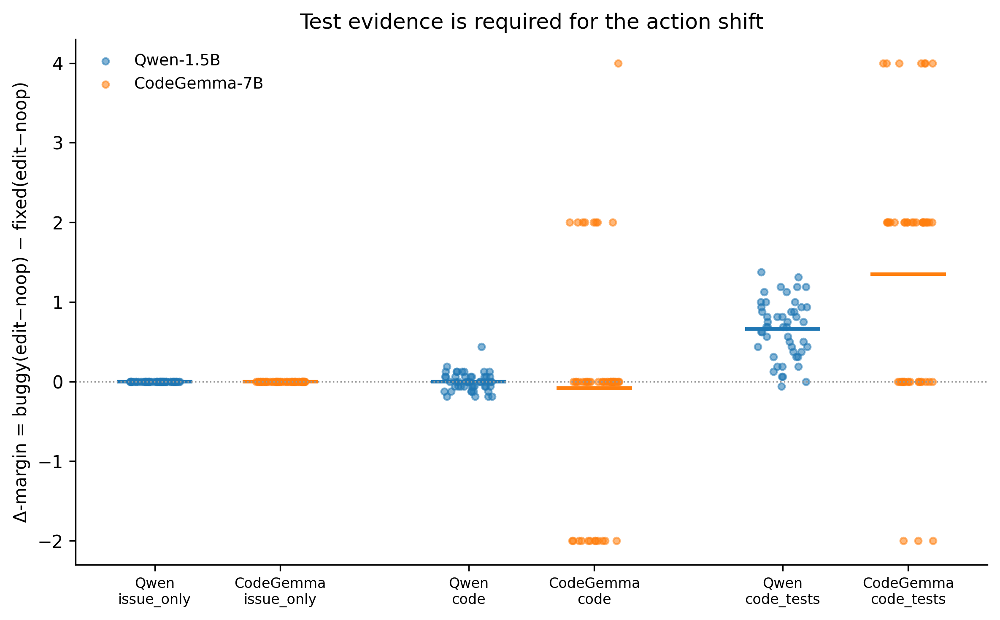{width=90%}

**Probes saturate.** A logistic regression on `resid_post` predicting
`buggy` vs `fixed` from features at any (layer, position) achieves AUC ≈
1.0 across all 28 layers under `code_tests`, including layer 0 (raw
embeddings). This is uninformative on its own: the prompts contain very
different surface text (`FAILED` lines vs all-pass) and even the
embedding layer can trivially separate them. Probes confirm the
information is available somewhere in the residual stream; they do not
tell us *where the action decision reads it out*.

## D. Full patching heatmaps and negative control

Full Qwen and CodeGemma F→B layer×position heatmaps:

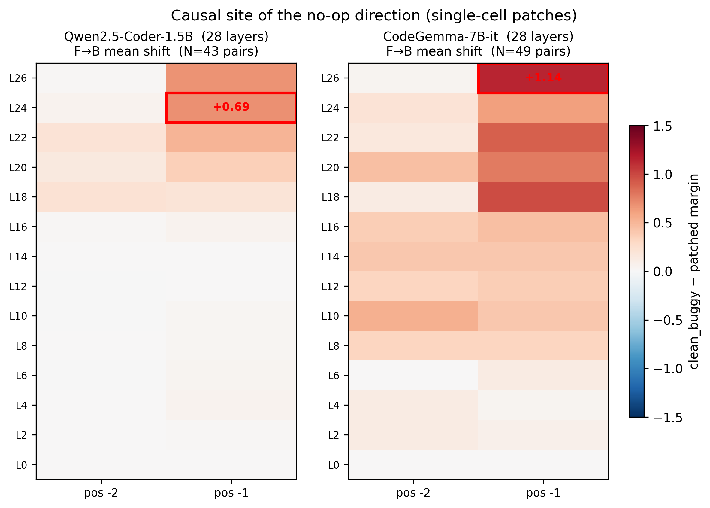{width=92%}

**Specificity to test evidence.** The same bidirectional patching protocol
on the `code` variant (no test transcript) shows no positive peak. At the
canonical L24/pos −1 cell, F→B mean shift is **+0.015** (median +0.000,
45% positive — essentially chance), compared to +0.688 (100% positive)
under `code_tests`. A small *negative* cluster appears at the very-late
layers L22–L26 / pos −1 (~−0.18 to −0.27), in the opposite direction of
the no-op shift: substituting unrelated residual content at this site
without test-evidence routing tends to weakly push the action toward
`edit`. We interpret this as the L24/pos −1 site being a test-evidence-
conditional readout — in the absence of the upstream evidence it does
not encode the no-op direction at all.

{width=60%}

## E. Steering dose-response per-task curves

Per-task dose-response across α ∈ {−3, …, +3}, Qwen + CodeGemma overlay:

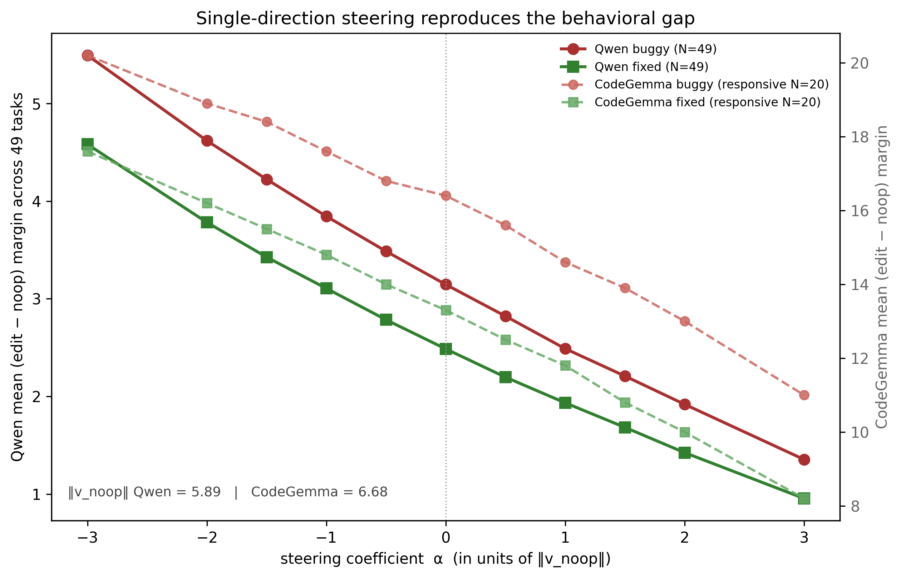{width=90%}

This is a stronger claim than patching: patching replaces a 1536-dim
vector; steering shows the effect can be reproduced by a single rank-1
additive intervention. The no-op information lives along **one specific
direction**, not in a high-rank subspace.

## F. Stale-variant failure analysis and toy-monitor LOOCV

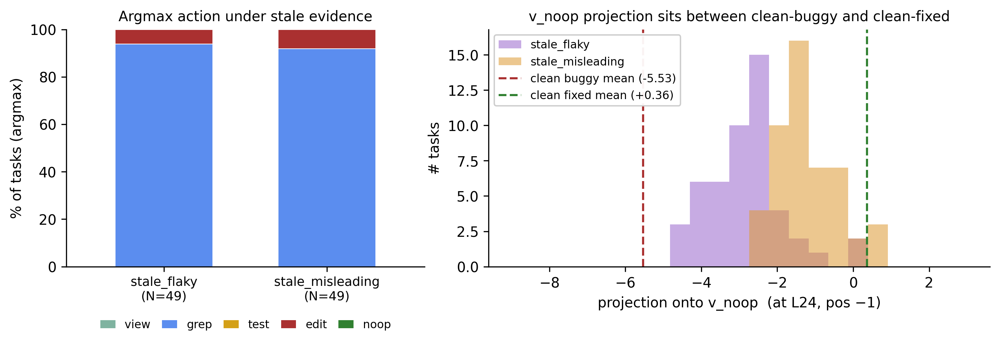{width=92%}

A monitor that thresholds the v_noop projection converts the latent
signal into an overt abstention recommendation, recovering the `noop`
action the model declines to emit. Under leave-one-out CV on the 49
clean buggy/fixed pairs the monitor achieves ROC-AUC = 1.000 and AP =
1.000, with 100% precision and 100% recall at the balanced-accuracy
operating point. We do not claim this clean separation persists on
stale-evidence prompts (where the latent projection compresses toward
zero); a calibrated pre-edit monitor uses the threshold learned on
clean pairs to flag prompts whose projection crosses into the no-op
region and propose abstention even when the model's argmax declines to.

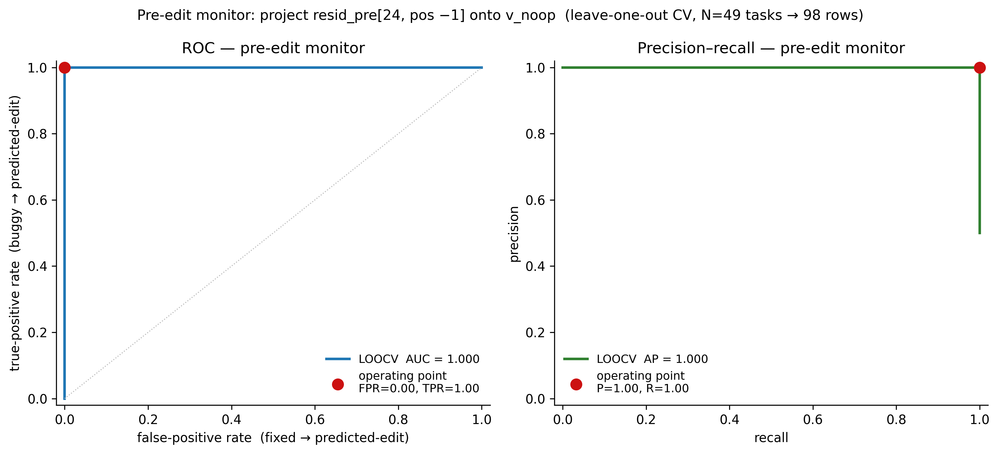{width=92%}

## G. Real-task evaluation: full per-task tables and baselines

### G.1 Real-task ingestion and projection statistics

The full SWE-bench Verified evaluation was conducted on 499 / 497 / 499
instances (Qwen / CodeGemma / DeepSeek; 1 instance dropped at
ingestion because its modified file no longer exists at the base
commit; 2 additional CodeGemma instances dropped for exceeding a
2400-token cap needed to avoid A10G OOM on the 7B model). Each
instance was ingested using a deterministic script extracting an
80-line window around the gold patch's largest Python hunk, applying
the hunk in-memory to derive the fixed counterpart, and synthesising
a pytest transcript from the dataset's `FAIL_TO_PASS` and
`PASS_TO_PASS` lists (no Docker / pytest execution required).

Projecting `resid_pre` at each model's toy-trained intervention site
onto its unit v_noop:

| condition / source        | model         | layer/pos    | mean proj | gap       | N  |
|---------------------------|---------------|--------------|-----------|-----------|----|
| Real buggy                | Qwen-1.5B     | L24 / pos −1 | **−2.18** | —         | 499 |
| Real fixed (stale)        | Qwen-1.5B     | L24 / pos −1 | **+2.56** | **+4.73** | 499 |
| Real buggy                | CodeGemma-7B  | L26 / pos −1 | **−10.85**| —         | 497 |
| Real fixed (stale)        | CodeGemma-7B  | L26 / pos −1 | **−7.98** | **+2.87** | 497 |
| Real buggy                | DeepSeek-1.3B | L22 / pos −1 | **+13.16**| —         | 499 |
| Real fixed (stale)        | DeepSeek-1.3B | L22 / pos −1 | **+18.81**| **+5.64** | 499 |
| Toy clean-buggy reference | Qwen-1.5B     | L24 / pos −1 | −5.53     | —         | 49 |
| Toy clean-fixed reference | Qwen-1.5B     | L24 / pos −1 | +0.36     | +5.89     | 49 |

The earlier N=99 reading of the two-model monitor was AUC 0.993
(Qwen) / 0.958 (CodeGemma); the full-benchmark numbers regress
modestly (Δ −0.004 Qwen / −0.025 CodeGemma) as the broader
distribution surfaces more edge cases.

### G.2 v_noop's direction is privileged (specificity baselines)

Two specificity controls on Qwen at the same site (L24, pos −1, real
SWE-bench N=99):

- **Random unit-direction baseline (N = 1000).** Drawing N = 1000 unit
  vectors uniformly on the 1535-sphere at (L24, pos −1) and computing
  the |AUC| each one attains as a signed-projection classifier yields a
  random-AUC distribution with mean 0.702, p95 0.916, p99 0.953, and
  max 0.983 (over all 1000 draws). **v_noop's 0.993 sits at the 100th
  percentile** — it beats every one of 1000 random directions. The
  random-direction max (0.983) is a stricter ceiling than the p99 and
  is still below v_noop, so the gap is not a chance artefact.
- **Full-residual probe (1536 parameters, LOOCV).** A logistic-
  regression probe trained on the full 1536-D residual at (L24, pos
  −1) under leave-one-out CV over the 99 paired tasks reaches **ROC-
  AUC = 1.000** (likewise at L27/pos −1). v_noop's 1-D projection
  captures essentially all of the information the full-residual probe
  uses: 0.993 vs 1.000 (caveat: with d = 1536 ≫ n = 99 the LR probe
  has substantial in-LOOCV overfitting risk, so 1.000 is an
  upper bound on what's mechanistically separable; v_noop's 0.993
  with one degree of freedom is a much tighter claim).

These together imply that **v_noop is privileged among directions
at this site, and a single multiply-add monitor is essentially
information-equivalent to a 1536-parameter probe** — strong evidence
the no-op signal is concentrated in a specific direction, not diffused
across the residual stream.

### G.3 CodeGemma scaling regression: per-repo breakdown

The CodeGemma false-edit rate at the operating point is 15.5% (77 of
497) vs Qwen's 2.6%. Per-task analysis on the N=497 cache attributes
this gap to two repos: **73% of the 77 false-edits come from
`django/django` (44 cases, 19.0% repo rate) and `sphinx-doc/sphinx`
(12 cases, 27.3% rate)**, with `pylint-dev/pylint` worst by rate
(3/10 = 30.0%). Qwen flags the same prompts correctly almost
everywhere: only **2 of CodeGemma's 77 misclassifications are also
misclassified by Qwen** (2.6% overlap). Misclassifications are near-
threshold rather than catastrophic — 62% sit within +1 logit of the
operating point, 95% within +2; mean misclassified score is +10.26 vs
the +9.40 threshold. Token-length analysis rules out long prompts as
the driver (Mann-Whitney p = 0.20).

**Per-repo AUC and calibration counterfactual.** Per-repo AUCs on the
largest two repos are near the headline: **django/django 0.946 and
sphinx-doc/sphinx 0.933** (the global is 0.933) — the false-edit
concentration is a threshold-calibration issue, not a per-repo
discrimination collapse. Letting each repo (N_fixed ≥ 10) use its
own balanced-accuracy threshold instead of the global one drops the
**pooled false-edit rate from 15.5% to 10.7% at essentially unchanged
recall (89.1% → 87.9%)** across 994 buggy/fixed observations — a 31%
relative reduction in false edits without retraining v_noop. The one
per-repo outlier is `pylint-dev/pylint` (AUC 0.830 on N_fixed = 10);
deployers targeting a pylint-heavy codebase should expect the bulk
calibration recipe to be less effective there and gather a small
project-specific calibration set.

## H. SAE decomposition: full analysis

### H.1 Setup and geometric finding

We trained a TopK SAE (Gao et al., 2024; Bricken et al., 2023;
Templeton et al., 2024) on Qwen2.5-Coder-1.5B L24 resid_pre
activations cached over our task substrate — 1.23M positions drawn
from all 148 paired tasks × all five prompt variants × both buggy
and fixed conditions (~1282 prompts). Architecture: d_in = 1536,
d_sae = 4096, k = 16. The SAE reached explained variance EV = 0.976
with 16.0 mean active features and a 0.02% dead-feature rate after
8 epochs on a Modal A10G (73 s training, ~$0.02). This corpus was
chosen after a generic Python-only SAE (d_sae = 24,576, k = 32,
EV = 0.954 on `bigcode/the-stack-smol`) reconstructed v_noop with
cosine only +0.21: the action-position residual after a chat-
templated agent prompt is out of distribution for mid-Python-file
activations.

**v_noop is geometrically dense in the SAE basis.** On the task-
distribution SAE the encoder TopK reconstruction of v_noop is poor
(cos = +0.10 at k = 16, the trained sparsity). To separate "encoder
is suboptimal for OOD steering directions" from "v_noop is intrinsically
dense in this basis," we evaluate **orthogonal matching pursuit
(OMP)** — at each k, greedily pick the decoder columns that best
explain the residual after refitting, the optimal k-sparse
reconstruction. The "OMP-then-ablate" sequence is the manual analogue
of automated-circuit-discovery methods such as ACDC (Conmy et al.,
2023). OMP needs k ≈ 128 features to reach cos ≥ 0.80 (task
SAE 0.806; generic SAE 0.838) and k ≈ 256 to clear cos ≥ 0.85 (task
0.900; generic 0.947) on either SAE. The basis itself spans the full
input space (dense least-squares cosine = 1.000), so this is not a
capacity bug — v_noop simply does not admit a small-k sparse
expansion. Encoder-TopK underperforms OMP by 0.2–0.4 cosine at every
k, indicating that the trained encoder biases are tuned to typical
residuals (norm ~30) and degrade for steering directions of small
magnitude (‖v_noop‖ = 5.89).

### H.2 Cumulative top-k ablation and behavioural-sparse finding

A fine-grained cumulative sweep over k ∈ {1, 2, …, 8, 16, 32, 128}
re-runs the same ablation pipeline at every cut. The reduction-vs-k
curve is sharply non-linear:

|  k  | reduction % | 95% CI (B=10K)       | Wilcoxon p |
|----:|------------:|----------------------|-----------:|
|  1  |   −0.10%    | [−0.29%, +0.00%]     | 0.84       |
|  2  |  **+26.4%** | [+20.4%, +32.7%]     | 5.3e-13    |
|  3  |  **+34.0%** | [+26.4%, +42.0%]     | 1.1e-13    |
|  4  |   +34.0%    | [+26.4%, +41.8%]     | 1.1e-13    |
|  5  |   +33.9%    | [+26.3%, +41.7%]     | 1.3e-13    |
|  6  |   +33.9%    | [+26.3%, +41.7%]     | 1.3e-13    |
|  7  |   +33.9%    | [+26.3%, +41.8%]     | 1.3e-13    |
|  8  |   +33.9%    | [+26.2%, +41.6%]     | 1.3e-13    |
| 16  |   +37.7%    | [+23.7%, +52.0%]     | 1.8e-06    |
| 32  |   +37.5%    | [+23.7%, +51.3%]     | 1.9e-06    |
| 128 |   +37.4%    | [+23.8%, +51.3%]     | 2.1e-06    |

The reduction is essentially zero at k = 1, jumps to +26% at k = 2,
clears the +34% ceiling at k = 3, and is **flat at +34% from k = 3
through k = 8**. The behaviourally sufficient subset is **three
features, not eight**.

### H.3 Specificity controls: two random-8 baselines

| set                           | reduction % | across-seed 95% CI | Mann-Whitney p vs OMP top-8 |
|-------------------------------|-------------|--------------------|------------------------------|
| OMP top-8                     | **+33.11%** | [+25.4%, +40.9%]   | —                            |
| random-8 (any, 10 seeds)      | +0.00%      | [−0.08%, +0.08%]   | **3.0 × 10⁻⁹⁶**             |
| random-8 (firing≥5, 10 seeds) | −0.85%      | [−9.3%, +7.3%]     | **3.9 × 10⁻¹⁷**             |

The first baseline draws from {0,…,4095}\\OMP_top128 uniformly; per-task
gap shifts are essentially zero on every seed because TopK sparsity (k = 16
per position) means a random feature draw rarely overlaps the firing set
on any given prompt. The **firing-only baseline** is the tighter
control: drawing 8 random features from the 45 actively-firing features
outside OMP top-128 gives a per-seed reduction distribution between
−21.7% and +19.6%, averaging to −0.85% across 10 seeds. Only OMP's
signed-coefficient-aware selection produces consistent positive
reduction.

### H.4 Action-level effect of OMP top-8 ablation

Argmax shifts per (task, condition) under OMP top-8 ablation on Qwen:

|         condition          | view | grep | test | edit | noop |
|----------------------------|-----:|-----:|-----:|-----:|-----:|
| **buggy** — clean          | 0.0% | **83.8%** | 0.0% | 16.2% | 0.0% |
| **buggy** — OMP top-8      | 0.0% |  5.4% | 0.7% | **93.9%** | 0.0% |
| **fixed** — clean          | 0.0% | **83.1%** | 0.0% | 16.9% | 0.0% |
| **fixed** — OMP top-8      | 0.0% |  1.4% | 0.0% | **98.6%** | 0.0% |

Ablating the OMP top-8 SAE features flips the argmax on **237 of 296
prompts (80.1%)**; **every flip is `grep → edit`** (1 prompt flipped
`grep → test`; no other transitions). This is **behavioural override**,
not calibration.

### H.5 Top-5 OMP features form a coherent no-op circuit

- **F2669** (OMP coef −1.10, contrib +0.236): promotes ' error',
  ' Error', ' errors'. v_noop *subtracts* this — attenuating error-
  attention is consistent with "the test output does not warrant a fix."
- **F3129** (coef −0.58, contrib +0.118): promotes ' traceback',
  ' Trace'. v_noop again *subtracts* this.
- **F3171** (coef +0.75, contrib +0.099): promotes ' already',
  ' Already' and suppresses ' corrected', ' corrections'. v_noop *adds*
  this — boosting "already done" semantics.
- **F2950** (coef +1.17, contrib +0.130): logit-lens suppresses
  `\tedit`, `\tview`, `\tgit` — leading-tab action tokens. v_noop *adds*
  this — boosting action-token suppression.
- **F1954** (coef +1.81, contrib +0.206): fires almost exclusively on
  '#' (Python comment marker).

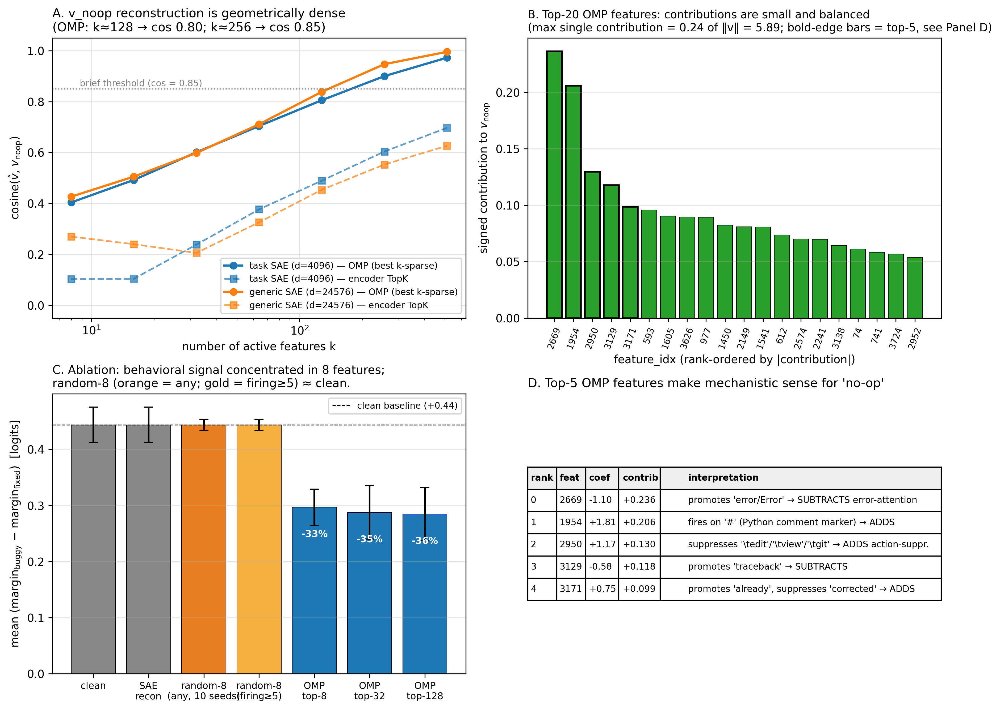{width=98%}

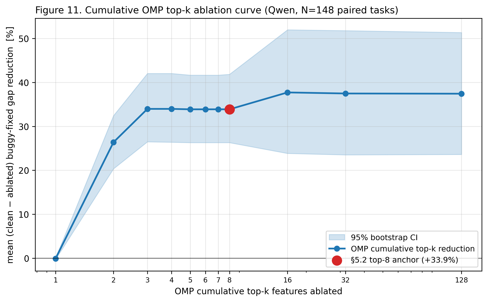{width=85%}

### H.6 Cross-model SAE replication on CodeGemma (partial)

We repeated the entire pipeline on CodeGemma-7B-it at L26/pos −1
using the frozen v_noop_cg direction. The **geometric** finding
replicates; the **behavioural** specificity finding does **not**.

**Setup.** We cached 1.20M positions of L26 resid_pre over the 1282
task prompts and trained a TopK SAE with d_sae = 8192, k = 48 (linear
scaling from Qwen's d_sae/d_in = 2.67 ratio; we initially trained at
k = 24 matching Qwen's ratio but reached only EV = 0.75 — below our
gate — so retrained at k = 48). The k = 48 SAE reached **EV = 0.830**
with 0.0% dead features (in the [0.80, 0.85] caveat band).

**Geometric result.** OMP k = 128 → cos 0.677, k = 256 → cos 0.779,
k = 1024 → cos 0.969 — same "resist-sparsity" character as Qwen.

**Behavioural result.** Running the per-feature-set ablation pipeline
on the 146 paired tasks that fit under the 2400-token cap:

| set                 | mean gap | reduction | 95% CI            | Wilcoxon p |
|---------------------|----------|-----------|-------------------|------------|
| clean (CodeGemma)   | +2.589   | —         | —                 | —          |
| sae_recon (control) | +2.589   | 0.0%      | —                 | —          |
| ablate OMP top-8    | +2.425   | **+6.4%** | [−3.2%, +16.4%]   | **0.103**  |
| ablate OMP top-32   | +3.178   | −22.7%    | [−34.4%, −11.1%]  | 1.00       |
| ablate OMP top-128  | +2.972   | −14.8%    | [−25.4%, −4.2%]   | 1.00       |

On CodeGemma the OMP top-8 reduction is **+6.4%** (CI includes zero,
p = 0.10 — not significant), and the larger subsets *increase* the
buggy-fixed gap by 15–23%. The behavioural specificity claim that
holds on Qwen does not hold on CodeGemma. Three candidate
explanations, none isolable without further compute: (i) CodeGemma's
SAE was weaker (EV 0.830 vs Qwen 0.976); (ii) v_noop_cg was derived
from a smaller paired-task substrate (N = 20 vs 49 on Qwen); (iii)
CodeGemma's L26 may not encode the edit-vs-noop signal as a clean
low-rank composition the way Qwen's L24 does, even though both
sites are homologous by relative depth and the monitor transfers
cleanly to both.

**One CodeGemma feature is interpretable.** Feature 6974 (OMP rank
2, coef +1.05, contribution +0.170) promotes ` passed`, ` OK`,
` pass` — the test-passing analogue of Qwen's "already-done" feature,
with positive v_noop_cg contribution consistent with "no fix needed
because tests pass." The other top-5 features have lower logit-lens
interpretability (top promotions/suppressions are rare non-English
tokens), likely reflecting CodeGemma's larger vocabulary and the
more polysemantic features expected at 7B scale.

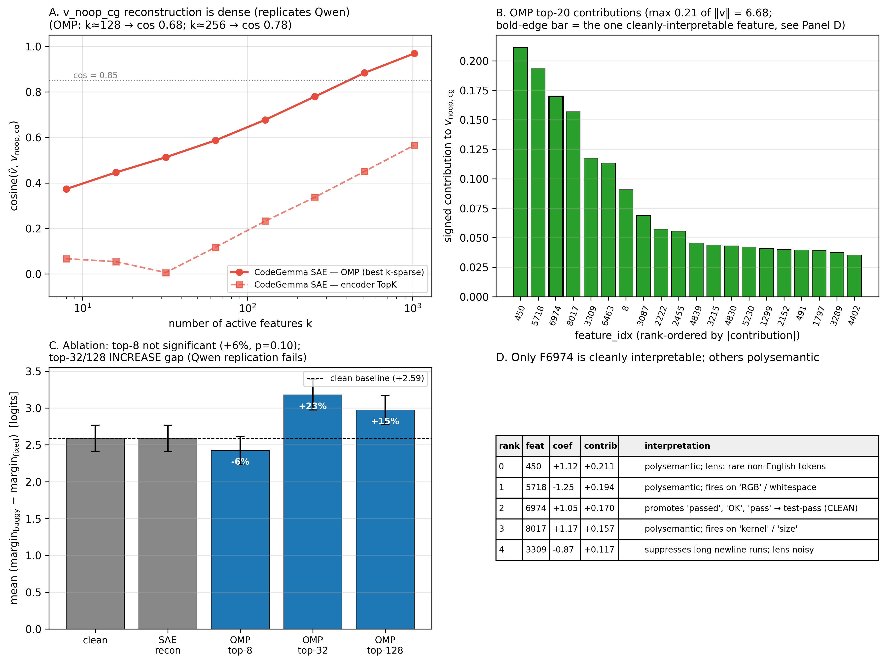{width=98%}

## I. In-context attribution within the cached last-32-token window

On the existing toy cache the residual stream is stored only for the
**last 32 token positions** of each prompt. Across all 49 paired
toys the last-32-token sequence is identical: 13 tokens of canonical
question text, 11 tokens of chat-template close, and 6 tokens of
`Action: ` suffix. Any buggy-vs-fixed differential in the L24
resid_pre projection onto v_noop at a given offset is therefore
**purely attentional information flow** from the earlier (varying)
test-output and code content.

**Per-offset projection** (per-offset paired Wilcoxon p < 10⁻¹⁰ at
every position):

| section                       | offset range | mean(buggy) | mean(fixed) | differential |
|-------------------------------|--------------|------------:|------------:|-------------:|
| question text                 | [−31, −19]   | +2.25       | +3.24       | **+0.99**    |
| chat-template close           | [−18, −7]    | +2.36       | +3.10       | **+0.74**    |
| `Action: ` suffix             | [−6, 0]      | −0.94       | +2.40       | **+3.34**    |

The differential grows monotonically as we approach the Action
position, from ≈+1 logit-unit at offset −31 to **+5.9 at offset 0**.
The per-token Action: suffix differential (+3.34) is **4.5× stronger**
than the question-text section (+0.99). The v_noop signal is present
throughout the prompt tail but **crystallises sharply over the final
six positions**.

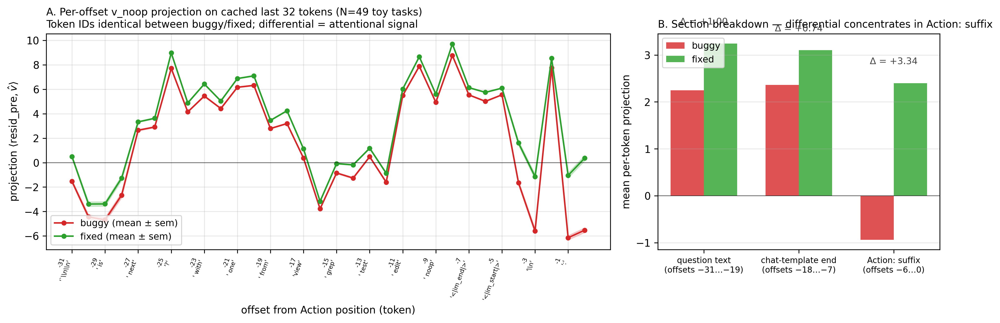{width=98%}

## J. Practical deployment considerations

### J.1 Per-model threshold calibration

§5.1's metrics use the global balanced-accuracy operating point, which
is the *wrong* threshold for most production deployments where the
false-edit cost asymmetry argues for a stricter setting. As an
example, raising the CodeGemma threshold from the balanced default
(T = +9.40, false-edit 15.5%, recall 89.1%) to **T = +10.53 drops
false-edit to 4.8% at the cost of recall 60.4%**; on DeepSeek the
analogous move (T = −16.78 → T = −13.06) drops false-edit from 19.6%
to 4.8% at recall 43.9%. Appendix G.3 argues for further *sub-model*
calibration on CodeGemma: letting each repo (N_fixed ≥ 10) use its
own balanced threshold drops the pooled false-edit rate from 15.5%
to 10.7% at pooled recall 87.9%, a 31% relative reduction in false
edits without retraining v_noop. The recipe: for any new
(model, codebase) pair, evaluate on a small held-out set (≈30 buggy
+ ≈30 fixed prompts — the sample size at which a paired two-sample
test reliably detects a Cohen's d ≈ 0.5 effect at α = 0.05 with
power ≥ 0.80) to set a project-specific operating threshold;
optionally split by repo or file pattern when sample size permits;
monitor the false-edit rate in production and recalibrate
periodically. We have not validated this recipe in a real agent
loop — it is a deployment *template*, not a deployment *study*.

### J.2 Veto semantics for the monitor in an agent loop

The deployment recipe leaves open *how* the monitor's verdict
translates into agent behaviour. Three concrete integration patterns
span the design space. First, a **hard veto**: if the monitor
predicts "no patch warranted" with confidence above a calibrated
threshold, the agent's `edit` action is silently replaced with `noop`
and the agent's turn ends; no re-prompting. Simplest to deploy and
adds zero forward-pass overhead beyond the monitor itself, but
discards the agent's downstream reasoning entirely. Second, a **soft
veto with re-prompting**: the monitor's verdict is appended to the
prompt as an additional evidence line (e.g. *"Pre-edit monitor: the
residual stream at the action position predicts the issue is already
fixed (projection = X, threshold = Y)"*), and the agent is
re-prompted with this extra context. Preserves agent autonomy at the
cost of one additional forward. Third, a **two-stage gate**: the
agent's `edit` proposal is held in a pending state, and a separate
review pass — the same model with the patch as additional context, or
a downstream reviewer — decides whether to commit; useful for batched
/ async agent setups. The right choice depends on the cost asymmetry
of the deployment regime: false-edits are typically cheaper to recover
from than false-noops in interactive coding agents, but the ratio
flips in autonomous batch settings (e.g. an overnight repo-cleanup
agent) where a missed noop becomes a spurious PR humans have to read
and reject. We surface this cost-asymmetry as an agent-deployment
intuition rather than a cited finding — to our knowledge no formal
cost analysis of false-edit-vs-false-noop in interactive coding
agents exists in the published literature, and quantifying it remains
open. A second deployment caveat: none of these patterns is free.
Each adds engineering surface and at least one additional projection
per agent call; for deployments where the agent's argmax-action is
already mostly correct on the target distribution (e.g. base-rate
accuracy > 95% on prompts the agent will actually see in production),
the false-edit reduction the monitor offers may not justify the
integration cost, and the right deployment decision is to skip the
monitor entirely. None of the three semantics has been empirically
validated in our work; which one is right is a deployment decision,
not a paper claim.

## K. Reproduction

### K.1 Bootstrap

```bash
git clone <repo>
cd no-op-circuit && python -m venv .venv && source .venv/bin/activate
pip install -e ".[analysis]"
cp .env.example .env        # fill in MODAL_TOKEN_ID, MODAL_TOKEN_SECRET,
                            # HF_TOKEN, OPENROUTER_API_KEY
```

### K.2 Cost table

Total Modal compute across all experiments: **~$8.91**; OpenRouter
(LLM-generated tasks + flaky transcripts): **~$6**; total cloud cost
**~$14.91**. Phase-by-phase breakdown in the project repo
(`paper/draft.md` history for the long-form per-experiment cost
table; this appendix collapses it to the headline).

### K.3 Entry points

All Modal entry points expose `--model`, `--layer`, and `--run-id`
flags. The three core jobs:

```bash
# Cache residual streams for all 49 tasks × variants × {buggy, fixed}
modal run -m modal_app.cache_dataset --model <hf-slug> \
  --variants issue_only,code,code_tests

# Bidirectional activation patching (peak-cell heatmaps)
modal run -m modal_app.patch_dataset --model <hf-slug> \
  --variant code_tests --max-suffix 2 --layer-step 2 --bidirectional

# Single-direction steering (computes v_noop, sweeps α)
modal run -m modal_app.steer_dataset --model <hf-slug> \
  --cache-dir results/cache-<RUN_ID> \
  --variant code_tests --layer <peak> --position -1
```

Local analysis scripts (`scripts/run_monitor_real.py`,
`scripts/ablation_stats.py`, `scripts/codegemma_per_repo_calibration.py`,
`scripts/incontext_attribution.py`, `paper/figures/render_all.py`)
regenerate all monitor metrics and figures from the cached `.pt`
files and the trained v_noop / SAE artefacts under `results/`.
